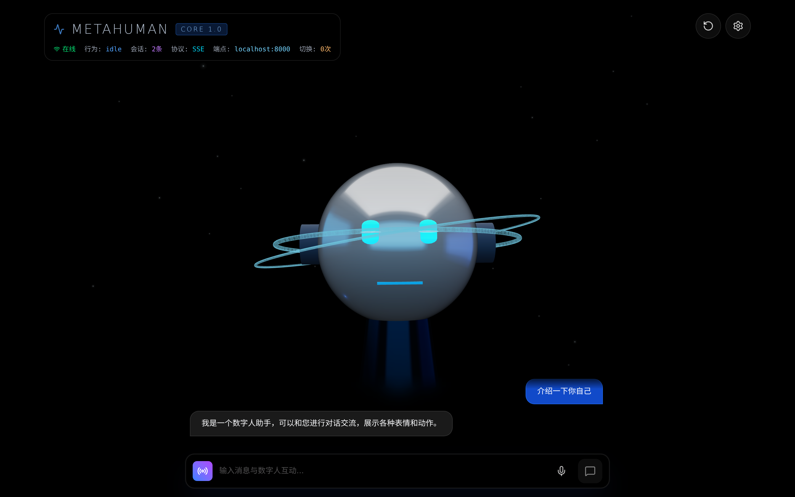

# MetaHuman Engine

浏览器原生 3D 数字人交互引擎。能听、能说、能对话，零配置即可运行。

[](https://github.com/vibe-knight/meta-human/actions)
[](https://vibe-knight.github.io/meta-human/)
[](package.json)
[](LICENSE)

<p align="center">
  <a href="https://vibe-knight.github.io/meta-human/#/app">
    
  </a>
</p>

<p align="center">
  <strong><a href="https://vibe-knight.github.io/meta-human/#/app">👉 点击在线体验数字人</a></strong>
</p>

---

打开页面，一个软萌可爱的 3D 数字人站在场景中央。你在底部输入框打字或点击麦克风说话，它会逐字回复你，说话时嘴部实时张合，语气带上表情与肢体动作。你也可以让它打招呼、跳舞、点头，或者直接换一套自己的 GLB 3D 模型上去。

**完全开箱即用**：不需要任何外部模型文件、不需要部署后端、不需要 API Key，克隆下来就能跑。接入后端后即可解锁真实 LLM 流式对话。

## ✨ 特性

- ⚡ **开箱即用** — 内置程序化 3D 形象，不依赖任何外部模型文件，加载秒开
- 💬 **真流式对话** — 支持 SSE 逐字流式回复，打字机实时展示，无需等待完整生成
- 👄 **嘴型同步 (Lipsync)** — TTS 语音朗读驱动嘴部高频实时张合，播报结束平滑闭嘴
- 🎭 **表情与动作联动** — 对话自动识别情绪与意图，联动开心/惊讶/思考等表情及挥手/跳舞等动作
- 🎙️ **语音交互闭环** — 支持麦克风语音输入（Web Speech ASR）与自然语音播报（TTS），可调语速/音调/音量
- 🧑‍🎤 **4 套角色预设** — 内置活泼助手、严肃顾问、可爱伙伴、专业客服，一键切换不同人设
- 🧩 **自定义形象** — 支持拖拽上传 GLB/GLTF 模型，文件损坏或加载失败自动安全回退
- 🛡️ **离线友好** — 无后端时自动走本地智能 Mock 回复，所有 3D 与语音交互功能均不受影响

## 🚀 快速开始

```bash
# 1. 克隆代码
git clone https://github.com/vibe-knight/meta-human.git
cd meta-human

# 2. 安装依赖并启动
npm install
npm run dev
```

启动后在浏览器打开：

- 🌐 **落地页**：`http://localhost:5173`
- 🤖 **数字人交互视口**：`http://localhost:5173/#/app`

> **交互小贴士**：
>
> - 鼠标左键拖拽旋转视角，滚轮缩放镜头，按键盘 `R` 键快速复位。
> - 右上角 ⚙️「设置」面板可自由调节语音参数、人设、触发动作，或上传你的 GLB 模型。

## 🔌 接入后端（可选）

前端自带本地智能模拟回复。若需要接入真实大模型对话，可启动配套的 Python FastAPI 参考服务（位于 `examples/backend-python/`）：

```bash
cd examples/backend-python

# 1. 创建并激活虚拟环境
python -m venv .venv
source .venv/bin/activate  # Windows: .venv\Scripts\activate

# 2. 安装依赖并启动
pip install -r requirements.txt
cp .env.example .env       # 填入 OPENAI_API_KEY（留空则自动走关键词 Mock 模式）
uvicorn app.main:app --reload --port 8000
```

### 前端连接后端

- **方式一（UI 实时切换）**：在前端界面右上角打开「设置 → API 配置」，填入 `http://localhost:8000`，立即生效并保存在 LocalStorage。
- **方式二（环境变量）**：在前端根目录 `.env` 中设置 `VITE_API_BASE_URL=http://localhost:8000`。

## 🌐 浏览器兼容性

| 能力                | Chrome / Edge | Firefox | Safari | 说明                       |
| ------------------- | :-----------: | :-----: | :----: | -------------------------- |
| 3D 渲染 (WebGL2)    |      ✅       |   ✅    |   ✅   | Three.js + R3F             |
| 文本对话 + 本地模拟 |      ✅       |   ✅    |   ✅   | 全平台支持                 |
| 语音播报 (TTS)      |      ✅       |   ✅    |   ✅   | Web Speech API             |
| 语音识别 (ASR)      |      ✅       |   ❌    |   ❌   | 依赖浏览器 Web Speech 引擎 |

## 🛠️ 技术栈

| 模块         | 技术选型                            |
| ------------ | ----------------------------------- |
| **前端框架** | React 19 + TypeScript 5 + Vite 6    |
| **3D 引擎**  | Three.js + React Three Fiber + Drei |
| **状态管理** | Zustand 5                           |
| **样式方案** | Tailwind CSS 4                      |
| **后端参考** | Python FastAPI + SSE 流式传输       |
| **单元测试** | Vitest + Testing Library            |

## 💻 开发者命令

```bash
npm run typecheck    # TypeScript 类型检查
npm run lint         # ESLint 代码检查
npm run test:run     # Vitest 单元测试
npm run build        # 生产构建
npm run format       # Prettier 代码格式化
```

架构分层、服务容器设计与贡献规范请参阅 [AGENTS.md](AGENTS.md)。

## 📄 许可证

本项目基于 [MIT](LICENSE) 许可证开源 © LessUp
