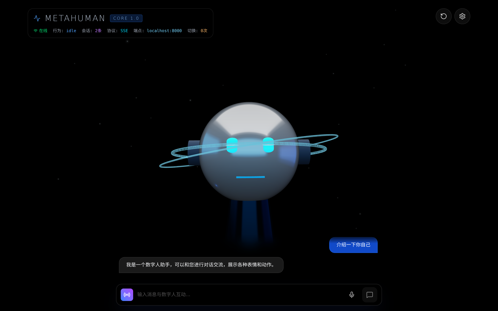

**English** | [中文](#chinese)

<a id="top"></a>

# MetaHuman Engine

A browser-native 3D digital human interaction engine with speech recognition, speech synthesis, and streaming conversation — zero configuration, ready to use out of the box.

[](https://github.com/build-workbench/meta-human/actions)
[](https://build-workbench.github.io/meta-human/)
[](package.json)
[](LICENSE)

<p align="center">
  <a href="https://build-workbench.github.io/meta-human/#/app">
    
  </a>
</p>

<p align="center">
  <a href="https://build-workbench.github.io/meta-human/#/app">Try the live Demo</a>
</p>

---

MetaHuman Engine is a lightweight 3D digital human interaction engine that runs in the browser. It ships with a procedural 3D avatar and a local intelligent Mock, so you can experience the full voice and conversation interaction right after cloning the repository; it also supports connecting a backend LLM and importing custom GLB models.

## Core Features

- **Out of the box**: Ships with a procedural 3D avatar and local reply logic; you can run it quickly without downloading external models or configuring API keys.
- **Streaming conversation**: Supports SSE character-by-character streaming with a typewriter effect for low-latency responses.
- **Lip sync**: Mouth opening and closing is driven in real time by TTS playback, and closes smoothly when playback ends.
- **Emotion and motion linkage**: Automatically parses conversation sentiment and intent, linking facial expressions (happy/surprised/thinking) with body motions (waving/nodding/dancing).
- **Full-duplex voice interaction**: Integrates the Web Speech API, supporting microphone voice input (ASR) and speech playback (TTS), with freely adjustable rate, pitch, and volume.
- **Preset personas and model import**: Includes 4 built-in character personas, supports drag-and-drop loading of custom GLB/GLTF models, with fallback protection on load failure.
- **Offline resilience**: Automatically falls back to the local intelligent Mock mode when the backend is disconnected, keeping the core interaction experience uninterrupted.

## Quick Start

```bash
# 1. 克隆代码
git clone https://github.com/build-workbench/meta-human.git
cd meta-human

# 2. 安装依赖并启动
npm install
npm run dev
```

Once started, open in your browser:

- Landing page: `http://localhost:5173`
- Digital human interaction viewport: `http://localhost:5173/#/app`

> **Operation tips**:
>
> - Viewport control: drag with the left mouse button to rotate, scroll to zoom, press `R` to reset quickly.
> - Settings panel: in the settings at the top right you can adjust voice parameters, switch characters, trigger motions, or import GLB models.

## Connecting a Backend (Optional)

The frontend uses local mock replies by default. To connect real LLM conversations, you can start the FastAPI reference service in the `examples/backend-python/` directory:

```bash
cd examples/backend-python

# 1. 创建并激活虚拟环境
python -m venv .venv
source .venv/bin/activate  # Windows: .venv\Scripts\activate

# 2. 安装依赖并启动
pip install -r requirements.txt
cp .env.example .env       # 填入 OPENAI_API_KEY（留空则进入 Mock 模式）
uvicorn app.main:app --reload --port 8000
```

### Frontend Connection

- **UI configuration**: In "Settings → API Configuration" at the top right of the page, enter the backend address (e.g. `http://localhost:8000`); it takes effect immediately and is saved in LocalStorage.
- **Environment variable**: Alternatively, set `VITE_API_BASE_URL=http://localhost:8000` in the `.env` file at the root of the frontend project.

## Tech Stack

| Module            | Technology                          |
| ----------------- | ----------------------------------- |
| Frontend framework | React 19 + TypeScript 5 + Vite 6   |
| 3D engine         | Three.js + React Three Fiber + Drei |
| State management  | Zustand 5                           |
| Styling           | Tailwind CSS 4                      |
| Backend reference | Python FastAPI (SSE streaming)      |
| Unit testing      | Vitest + Testing Library            |

## Common Commands

```bash
npm run dev          # 启动开发服务器
npm run typecheck    # TypeScript 类型检查
npm run lint         # ESLint 代码检查
npm run test:run     # Vitest 单元测试
npm run build        # 生产构建
npm run format       # Prettier 代码格式化
```

For the project's architecture layering and contribution guidelines, see [AGENTS.md](AGENTS.md).

## License

This project is open sourced under the [MIT](LICENSE) license.

---
<a id="chinese"></a>
[English](#top) | **中文**

# MetaHuman Engine

浏览器原生 3D 数字人交互引擎，支持语音识别、语音合成与流式对话，零配置开箱即用。

[](https://github.com/build-workbench/meta-human/actions)
[](https://build-workbench.github.io/meta-human/)
[](package.json)
[](LICENSE)

<p align="center">
  <a href="https://build-workbench.github.io/meta-human/#/app">
    
  </a>
</p>

<p align="center">
  <a href="https://build-workbench.github.io/meta-human/#/app">在线体验 Demo</a>
</p>

---

MetaHuman Engine 是运行在浏览器端的轻量级 3D 数字人交互引擎。内置程序化 3D 形象与本地智能 Mock，克隆仓库即可直接体验完整的语音与对话交互；同时支持接入后端大模型与导入自定义 GLB 模型。

## 核心特性

- **开箱即用**：内置程序化 3D 形象与本地回复逻辑，无需下载外部模型或配置 API Key 即可快速运行。
- **流式对话**：支持 SSE 逐字流式传输与打字机效果，低延迟响应。
- **口型同步**：由 TTS 语音播报实时驱动嘴部张合，播报结束平滑闭合。
- **情感与动作联动**：自动解析对话情绪与意图，联动面部表情（开心/惊讶/思考）与肢体动作（挥手/点头/跳舞）。
- **语音全双工交互**：集成 Web Speech API，支持麦克风语音输入（ASR）与语音播报（TTS），可自由调节语速、音调与音量。
- **预设人设与模型导入**：内置 4 套角色人设，支持拖拽加载自定义 GLB/GLTF 模型并具备加载失败降级保护。
- **离线容灾支持**：未连接后端时自动降级到本地智能 Mock 模式，核心交互体验不中断。

## 快速开始

```bash
# 1. 克隆代码
git clone https://github.com/build-workbench/meta-human.git
cd meta-human

# 2. 安装依赖并启动
npm install
npm run dev
```

启动后在浏览器中访问：

- 落地页：`http://localhost:5173`
- 数字人交互视口：`http://localhost:5173/#/app`

> **操作提示**：
>
> - 视角控制：鼠标左键拖拽旋转，滚轮缩放，按 `R` 键快速复位。
> - 设置面板：右上角设置中可调节语音参数、切换角色、触发动作或导入 GLB 模型。

## 接入后端（可选）

前端默认使用本地模拟回复。如需接入真实大模型对话，可启动 `examples/backend-python/` 目录下的 FastAPI 参考服务：

```bash
cd examples/backend-python

# 1. 创建并激活虚拟环境
python -m venv .venv
source .venv/bin/activate  # Windows: .venv\Scripts\activate

# 2. 安装依赖并启动
pip install -r requirements.txt
cp .env.example .env       # 填入 OPENAI_API_KEY（留空则进入 Mock 模式）
uvicorn app.main:app --reload --port 8000
```

### 前端连接方式

- **界面配置**：在页面右上角「设置 → API 配置」中输入后端地址（如 `http://localhost:8000`），即时生效并保存在 LocalStorage。
- **环境变量**：或在前端项目根目录 `.env` 中设置 `VITE_API_BASE_URL=http://localhost:8000`。

## 技术栈

| 模块     | 技术选型                            |
| -------- | ----------------------------------- |
| 前端框架 | React 19 + TypeScript 5 + Vite 6    |
| 3D 引擎  | Three.js + React Three Fiber + Drei |
| 状态管理 | Zustand 5                           |
| 样式方案 | Tailwind CSS 4                      |
| 后端参考 | Python FastAPI (SSE 流式传输)       |
| 单元测试 | Vitest + Testing Library            |

## 常用命令

```bash
npm run dev          # 启动开发服务器
npm run typecheck    # TypeScript 类型检查
npm run lint         # ESLint 代码检查
npm run test:run     # Vitest 单元测试
npm run build        # 生产构建
npm run format       # Prettier 代码格式化
```

项目架构分层与贡献规范请参阅 [AGENTS.md](AGENTS.md)。

## 许可证

本项目基于 [MIT](LICENSE) 许可证开源。
